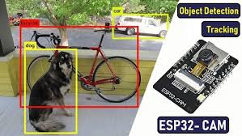
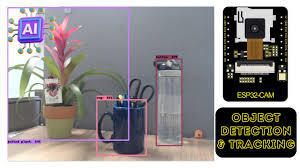

# YOLOv8 Object Detection Pipeline

**Description:** A real-time object detection system that uses an ESP32 camera to stream frames over Wi-Fi to a Flask server. The server runs a YOLOv8 model (20 classes) to identify objects (e.g., tables, chairs, whiteboards) and logs results for later analysis.

## Tech Stack
- **Embedded:** ESP32 (MicroPython, HTTP POST)  
- **Backend:** Python Flask (REST API, WebSockets)  
- **ML:** YOLOv8 (Ultralytics), PyTorch  
- **Frontend (Dashboard):** React, Chart.js  

## Features
1. **Real-time capture** from ESP32 camera module.  
2. **HTTP POST** & WebSocket streaming to Flask server.  
3. **On-the-fly inference** with YOLOv8 (20 custom classes).  
4. **Dashboard** that visualizes detection counts (React + Chart.js).  
5. **Automated logging** to a PostgreSQL database for historical analysis.

## Repo & Live Demo
- **Source Code:** [github.com/alimaqsoodahmed/object-detection](https://github.com/alimaqsoodahmed/object-detection)  
- **Live Dashboard:** <https://smart-home-dashboard.example.com> (if available)

## Screenshots

---

[← Back to Projects](../)
